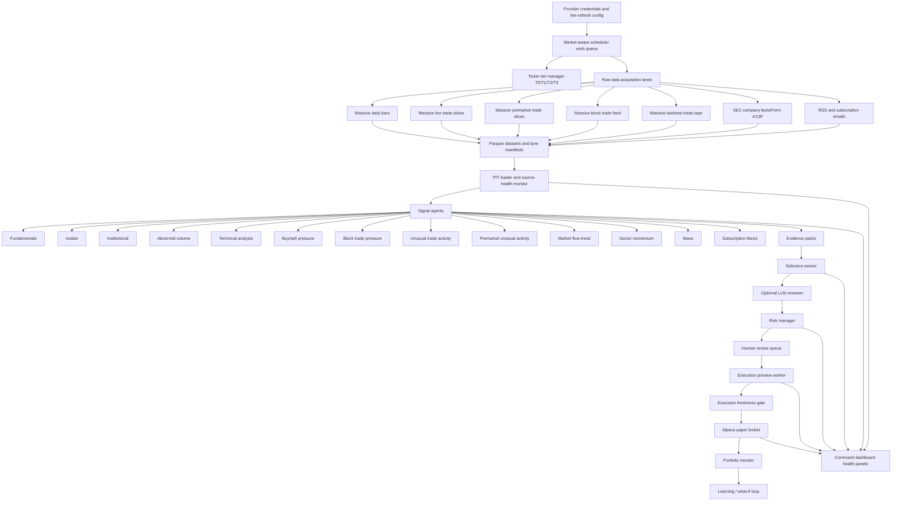

# Trading Agency Process, Agent, and Data Source Status

Generated: 2026-05-16, based on local runtime artifacts and direct Python status checks.

## Executive Status

The agency is **review-operational, but not complete-active-universe paper-tradable**.

Current readiness facts:

- Live config is ready for the active universe: **168 tickers**.
- Latest completed market session used by the data layer: **2026-05-15**.
- Data-load status: **ready=true**, **review_operational_ready=true**, **tradable_ready=false**.
- Runtime cycle: `full-active-runtime-qa-20260516b`.
- Runtime output: **168 evidence packs**, **1,494 signals**, **17 WATCH candidates**, **151 NO_TRADE candidates**.
- Risk output: **8 WARN**, **160 BLOCK**, **0 ALLOW**.
- Execution output: **0 orderable previews**, **168 submit_enabled=false**, **168 order intent hashes present**.
- Alpaca paper broker read: **connected**, **paper mode**, **ACTIVE account**, **1 position**, **0 open orders**.
- Dashboard HTTP app: **not reachable at `http://127.0.0.1:8000` during this check**.

Bottom line: the current system can produce review evidence and watch candidates from the latest available local artifacts, but it cannot honestly be called a complete paper-trading MVP until the dashboard server is up, full critical lane coverage is resolved, source-health monitoring is fresh, and the selection/risk/execution chain produces at least one safe orderable paper preview.

## Data Flow Block Diagram

## Current Data Source Status

| Data source | Current status | Evidence | Gap |
| --- | --- | --- | --- |
| Massive/Polygon daily bars | Working | `massive_daily_bars`: complete, 168/168 tickers, 168 rows, window 2026-05-15 | Needs normal after-close refresh cadence to keep complete |
| Massive/Polygon live trade slices | Partially working | `massive_live_trade_slices`: partial_usable, 94 tickers, 1,168,146 rows, window 2026-05-15 | Full active universe needs 168/168 critical coverage; latest scheduler target views are inconsistent at 50/74/94 |
| Massive/Polygon premarket slices | Partially working | `massive_premarket_trade_slices`: partial_usable, 50 tickers, 40,519 rows, window 2026-05-15 | Orchestrator still shows 24 pending in the current target set |
| Massive block trade feed | Partially working | `massive_block_trade_feed`: partial_usable, 50 tickers, 5,341 rows, derived from raw trade slices | Full-universe block coverage depends on full raw live-slice coverage |
| Massive backtest trade tape | Incomplete | `massive_backtest_trade_tape`: partial, 168 tickers, 25,303,168 rows, 17 percent coverage, 2026-05-08 to 2026-05-15 | Not a live-trading blocker, but not ready for full historical validation |
| Massive reference | Not verified | No lane manifest | Needs lane implementation/manifest if reference data is required |
| Massive options flow | Not verified | No lane manifest | Options flow is not active in the current runtime configuration |
| SEC company facts | Partially working | 167/168 tickers, 149,525 rows, source status HEALTHY/FRESH | Source-health row is stale; one active-universe ticker missing |
| SEC Form 4 | Partially working | Signal lane produced 168/168, dataset has 25,189 rows | Current refresh status says `sec_form4` still running; scheduler last tick timed out after 240s |
| SEC 13F | Working as context | 667 rows, 9 configured filers | Quarterly by nature; source-health row is old and should be refreshed |
| RSS/news | Incomplete/currently stale | 728 rows; 9 feeds configured | Source status STALE; latest success 2026-05-15T03:17:31Z |
| Subscription emails | Partially working | Latest ingest processed 50 emails and wrote 193 Seeking Alpha events | Linked article analysis failed: 25 attempted, 25 failed, 0 succeeded, 0 article links analyzed |
| OpenAI LLM | Configured, not contributing latest cycle | Provider readiness says OpenAI key present | Latest runtime had `llm_review_counts={"NO_REVIEW":168}` and no prompt audits; article LLM cannot help until article fetch succeeds |
| Alpaca paper broker | Working for read-only broker state | Fresh validation passed: connected, paper, ACTIVE, 1 position, 0 open orders | Trade submission is disabled; latest validation did not place a test trade |
| Postgres/persistence | Partially working | Latest persisted runtime artifacts exist | Fresh broker validation portfolio snapshots returned `persistence_status=unavailable`; HTTP app was down |
| Planned external providers | Not active | OpenFIGI, Benzinga, Unusual Whales, FRED, ThetaData are listed as planned/not configured | Not required for current MVP unless the strategy scope depends on them |

## Current Agent and Worker Status

| Agent/worker | Purpose | Current status | Notes |
| --- | --- | --- | --- |
| Live config readiness | Checks config, providers, universe, required local paths | Working | Reports ready for 168 active tickers |
| Scheduler work queue | Market-aware job routing, ticker tiers, ETAs, data lane commands | Partially working | Enabled, but latest tick state is `error` because `sec_form4` timed out |
| Ticker tier manager | Splits T0/T1/T2/T3 from holdings, queue, watchlist, universe | Working but empty high-priority tiers | T0=0, T1=0, T2=168, T3=90 |
| Massive lane orchestrator | Routes raw Massive acquisition by lane | Partially working | Uses lane model, but target/coverage accounting is still inconsistent |
| PIT loader | Reads point-in-time parquet/manifests for runtime | Working | Runtime cycle used PIT-backed datasets |
| Source-health monitor | Exposes data reliability/freshness | Incomplete | Health monitor status is stale; dashboard should not present it as live until refreshed |
| Fundamentals agent | SEC company facts to fundamental signal | Partially working | 136/168 signals; source is fresh but health row is stale |
| Insider agent | Form 4 activity to insider signal | Working as a signal lane | Produced 168/168 signals; extraction worker needs timeout cleanup |
| Institutional agent | 13F holdings to institutional signal | Context only/partial | 10 rows/signals; appropriate as quarterly context |
| Abnormal volume agent | Daily OHLCV abnormal volume | Working | 168/168 signals from fresh daily bars |
| Technical analysis agent | Daily bars to TA score, candles, patterns, trend | Working | 168/168 signals from fresh daily bars |
| Buy/sell pressure agent | Trade slices to signed pressure | Partially working | 166/168 signals, but source trade coverage is partial |
| Block trade pressure agent | Trade slices/block feed to large-print pressure | Partially working | 150/168 signals, depends on partial raw coverage |
| Unusual trade activity agent | Trade count/volume/notional anomalies | Partially working | 166/168 signals, depends on partial raw coverage |
| Premarket unusual activity agent | Premarket volume/gap/velocity anomalies | Partially working | 166/168 signals, but premarket raw lane is only 50-ticker partial usable |
| Market-flow trend agent | Rolling live slice trend/acceleration | Partially working | 166/168 signals, depends on partial raw coverage |
| Sector momentum / market regime | Daily bars to sector leadership/regime | Working but output shape needs review | Lane is ready; data-load summary shows produced_count 0 because it is a dashboard/regime aggregate rather than per-ticker rows |
| News agent | RSS/news to sentiment/context | Incomplete | 24 signals, source stale |
| Subscription thesis agent | Paid email/article thesis to ticker context | Incomplete | 6 signals; email headlines exist, article thesis is mostly missing |
| Selection worker | Converts evidence packs to WATCH/NO_TRADE and conviction | Working for review | Latest cycle: 17 WATCH, 151 NO_TRADE |
| LLM reviewer | Optional review/explanation for bounded candidates | Configured but inactive in latest cycle | No latest prompt audits and all candidates `NO_REVIEW` |
| Risk manager | Applies policy gates/exposure/source health | Working, but no orderable output | Latest cycle: 160 BLOCK, 8 WARN, 0 ALLOW |
| Human review queue | Lets user approve/defer/reject candidates | Implemented | Current server was down, so UI queue availability was not verified in this pass |
| Execution preview worker | Converts allowed risk decisions to order previews | Working defensively | Latest cycle has no orderable previews: 160 BLOCKED, 8 DISABLED, no side/notional |
| Execution freshness gate | Requires broker and critical evidence freshness before submit | Implemented | Cannot pass to actual submit while no READY order previews exist |
| Alpaca broker worker | Reads account/positions/orders and submits paper orders when enabled | Read path working | Fresh read-only validation passed; submission remains intentionally disabled |
| Portfolio monitor | Tracks exposure, positions, performance, exits | Partially working | Broker read works, but fresh snapshot persistence reported unavailable |
| Learning / what-if loop | Tracks outcomes and near misses for future calibration | Implemented as advisory | Needs audited outcome samples before it can tune thresholds |
| Dashboard/UX views | Command, signals, candidates, final selection, risk, execution, portfolio | Not currently live | Latest screenshot assets exist, but HTTP app was not reachable during this report |

## Latest Runtime Decision Flow

Latest cycle: `full-active-runtime-qa-20260516b`.

| Stage | Output |
| --- | --- |
| Evidence packs | 168 |
| Signals | 1,494 |
| Selection actions | 17 WATCH, 151 NO_TRADE |
| LLM review | 168 NO_REVIEW, 0 prompt audits |
| Risk decisions | 8 WARN, 160 BLOCK, 0 ALLOW |
| Execution previews | 160 BLOCKED, 8 DISABLED |
| Actual order side | 168 NONE |
| Notional/quantity | 0 previews with order size |
| Order intent hash | 168/168 previews have an intent hash |

Interpretation: the agency can rank and review candidates, but the current cycle does not contain a broker-ready trade. A human approval of a WATCH item does not automatically create an order unless a promotion/selection/risk pass upgrades it into an orderable BUY/SELL/SHORT/COVER preview.

## Lane Model Status

The lane model is partially implemented and is the right direction, but it is not yet clean enough to call complete.

What is working:

- Raw Massive data is separated into named lane manifests.
- Daily bars, live slices, premarket slices, block feed, and backtest tape each have separate status/progress.
- Derived signal lanes mostly read from lane outputs instead of all independently pulling Massive.
- Closed-market logic accepts 2026-05-15 as the latest completed session.

What is incomplete:

- Full active-universe critical market-flow coverage is still missing: data-load sees **94/168** usable trade-print coverage.
- The scheduler/orchestrator target accounting is inconsistent: latest status references 50-ticker and 74-ticker subsets while the active universe is 168.
- `massive_reference` and `massive_options_flow` do not have lane manifests.
- `massive_backtest_trade_tape` is only 17 percent complete.
- A stale/running `sec_form4` refresh status is polluting the Command health state.

## Dashboard and UX Status

Current dashboard status is **not verified live**.

Evidence:

- `scripts/check_operational_readiness.py` failed because `http://127.0.0.1:8000/status/operational-readiness` was unavailable.
- Last saved UI screenshots exist under `research/results/latest-ui-live-data-qa`, but there is no JSON/MD verdict artifact in that folder.
- `scripts/start_local_runtime.ps1` only seeds demo data when `-SeedDemo` is explicitly passed.
- Current live runtime/result artifacts did not show demo/monkey/mock runtime data, but this must remain guarded in startup and dashboard QA.

Required dashboard behavior before MVP:

- Command dashboard must show server live/offline state.
- Every page must show displayed data as-of, source status, freshness, and whether the page is tradable or review-only.
- Risk and execution pages must explain why a row is blocked, warned, disabled, or ready.
- Signals page must keep row selection on the signal detail unless the user explicitly navigates to candidate review.

## Paper Trading Status

Read-only paper broker access is working.

Fresh validation result:

- Provider: Alpaca
- Mode: paper
- Account status: ACTIVE
- Connected: true
- Equity: about 99,972.30 USD
- Buying power: about 198,972.29 USD
- Positions: 1
- Open orders: 0
- Gross exposure: about 0.97 percent
- Paper trade test: not run in this report

Incomplete for a complete paper-trading MVP:

- Broker submission is disabled.
- Latest runtime cycle has no READY execution previews.
- No current order has side, quantity, or notional.
- Portfolio snapshot persistence reported unavailable in the fresh read-only validation.
- The first-class flow from human-approved candidate to promoted order approval still needs a live end-to-end proof.

## Email and Article Analysis Status

Email headline ingestion is working, but article analysis is not currently usable.

Latest subscription-email ingest:

- Processed emails: 50
- News rows/events: 193
- Service rows: Seeking Alpha only
- Link attempts: 25
- Link successes: 0
- Link failures: 25
- Linked content analyzed: 0

This means the subscription thesis lane is mostly headline context right now. The required paid-article browser login/preflight flow exists in the code/docs, but the latest evidence says it did not successfully analyze article content.

## No-Test-Data Check

Current artifacts do not show demo/monkey/mock data in the latest runtime and data-refresh result folders. However:

- `scripts/seed_demo_runtime.py` exists.
- `scripts/start_local_runtime.ps1` supports `-SeedDemo`.
- The production startup path must never use `-SeedDemo`.
- Dashboard QA should keep checking rendered pages for demo/mock/fake/bootstrap source names.

## Highest Priority Gaps

1. **Bring the HTTP app back up and prove dashboard health.**
   - Definition of done: `/health`, `/status/operational-readiness`, `/status/data-load`, Command page, Signals page, Risk page, Execution page all respond with current data.

2. **Fix the Massive lane target accounting and finish critical coverage.**
   - Definition of done: active universe is consistently 168 across config, orchestrator, lane manifests, data-load status, and scheduler queue.
   - Live trade, premarket, and block-feed lanes either cover 168/168 or explicitly mark which tickers are review-only.

3. **Clear the `sec_form4` stale/running timeout state.**
   - Definition of done: no stuck `running` refresh status; timeout is split, resumed, or downgraded correctly without making Command health misleading.

4. **Fix paid article login and article LLM analysis.**
   - Definition of done: Seeking Alpha login preflight pauses before article fetch, user confirms login, links open in the authenticated browser, tabs close after analysis, and latest ingest shows successful article LLM thesis rows.

5. **Regenerate a fresh runtime cycle after data/source-health refresh.**
   - Definition of done: source-health rows are fresh, runtime summary references the latest completed session, and warnings match real lane/source gaps.

6. **Prove the order chain with paper-safe constraints.**
   - Definition of done: one approved candidate is promoted into an orderable preview, risk allows it, execution preview has side/notional/hash, human approves exact order intent, Alpaca paper submission is disabled/enabled intentionally, and audit records are persisted.

7. **Fix portfolio snapshot persistence.**
   - Definition of done: fresh broker validation persists portfolio snapshots instead of returning `persistence_status=unavailable`.

## Honest MVP Verdict

The current agency is **not yet a complete operational paper-trading MVP**.

It is currently a **review-operational research and candidate system** with real configured providers, fresh daily bars, partial real market-flow coverage, working Alpaca paper read access, and defensive execution gates. The remaining blockers are practical and specific: live dashboard availability, full critical lane coverage consistency, fresh source-health, working paid-article analysis, and an end-to-end orderable paper-trade path.
