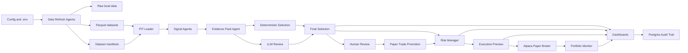

# Trading Agency v2 System Review

Last updated: 2026-05-12

This document describes the agency as implemented in this repository: its goals, architecture, workflow, agent and worker catalog, inputs, outputs, algorithms, dashboards, tools, and current operational caveats. It is intended for an external system review.

## 1. Agency Goals

Trading Agency v2 is a supervised equity research and paper-trading assistant. Its job is to collect market, filing, news, subscription, portfolio, and broker data; convert that data into explainable ticker-level evidence; rank candidates; apply risk and portfolio guardrails; present decisions for human review; and optionally submit guarded paper orders to Alpaca only when explicitly enabled.

The system is built around these principles:

- Human approval is required before paper execution.
- All research decisions are evidence-based and auditable.
- Backtests and runtime signals must use point-in-time data through the PIT loader.
- Inferred signals, such as market-flow pressure, need confirmed corroboration before they can meaningfully drive action.
- Paper trading is the operating mode. Broker submission is disabled unless local policy explicitly enables it.
- Data extraction is market-aware: fast update lanes run during active market windows; slow baseline repair runs off-hours.

## 2. High-Level Architecture



## 3. Core Storage and Contracts

| Layer | Purpose | Main Paths |
| --- | --- | --- |
| Raw local data | Ignored local source files, exports, and provider payloads. | `research/data/raw/` |
| Clean PIT data | Parquet datasets used by research and runtime. | `research/data/parquet/` |
| Manifests | Dataset row counts, checksums, freshness, source URLs, and ticker coverage. | `research/data/manifests/` |
| Runtime database | Persisted source health, evidence, reports, risk decisions, execution states, audit rows, and portfolio snapshots. | PostgreSQL via `src/agency/persistence/models.py` and `migrations/` |
| Contracts | Canonical JSON schemas for inter-agent payloads. | `schemas/*.schema.json` |
| Reports | Human-readable and machine-readable run artifacts. | `research/results/` |

## 4. Source and Data Extraction Agents

| Agent / Worker | Purpose | Algorithm | Inputs | Outputs | Tools / Modules | Status |
| --- | --- | --- | --- | --- | --- | --- |
| Universe Manager | Maintains the active ticker universe, including S&P 100 and QQQ membership. | Builds point-in-time membership rows from stored source snapshots and manual events; runtime can use configured tickers or active PIT universe. | Universe HTML snapshots, manual event CSV, as-of date. | `universe_membership.parquet`, manifest, active ticker list. | `research/src/universe/*`, `research/scripts/build_universe_membership.py` | Implemented. |
| Data Refresh Batch Agent | Runs baseline, incremental, and forced data refreshes. | Loads `live-refresh.local.json`, resolves datasets and tickers, builds job list, runs puller commands, writes progress, status, ETA, and output validation. | Refresh config, `.env`, existing manifests, provider credentials. | Updated parquet/manifests, `data-refresh-status.json`, `data-refresh-status.md`. | `research/src/data_refresh/*`, `research/scripts/run_data_refresh_batch.py` | Implemented. |
| Market-Aware Scheduler Planner | Decides what data should run now. | Classifies market phase, assigns cadence, priority, ticker tier, and extraction action. Defers slow SEC and baseline repair during live market windows. | Current time, market calendar rules, manifests, config. | Market-aware batch plan and scheduler dashboard context. | `research/src/data_refresh/market_batching.py`, `src/agency/runtime/scheduler_work_queue.py` | Implemented as planner and dashboard context. |
| Ticker Tier Manager | Maintains T0/T1/T2/T3 ticker priority lists. | T0 = holdings, open orders, approved reviews; T1 = review queue, watchlist, high conviction; T2 = remaining active universe; T3 = research/backfill. | Broker positions/orders, human review queue, selection reports, active universe. | Tier payload used by scheduler. | `src/agency/runtime/scheduler_work_queue.py` | Implemented. |
| Affected-Ticker Mini-Cycle Planner | Recomputes only affected tickers after important events. | Maps event type to impacted lanes and creates a one-ticker runtime command. | Email/news/Form4/Massive spike events. | Mini-cycle plan with command, ETA, and priority. | `src/agency/runtime/scheduler_work_queue.py` | Implemented as planning primitive. |
| Off-Hours Baseline Repair Agent | Fills missing data coverage without blocking market-hour operation. | Finds baseline/force jobs and runs or defers them depending on market phase. | Market-aware plan, ticker tiers. | Repair plan, ETA, status. | `src/agency/runtime/scheduler_work_queue.py` | Implemented as planning primitive. |
| Daily Price Agent | Loads daily OHLCV bars. | Pulls Massive as preferred provider when configured; supports Alpaca and yfinance fallback paths; normalizes daily bars and writes PIT datasets. | Tickers, date range, provider keys. | `prices_daily.parquet`, manifest. | `research/src/prices/*`, `pull_massive_grouped_daily.py`, `pull_yfinance_daily.py` | Implemented. |
| Massive Stock Trades Agent | Loads delayed confirmed stock prints for market-flow analysis. | Calls Massive/Polygon trade endpoints, handles pagination, normalizes price/size/timestamp/conditions, stores raw print-derived fields. | Massive or Polygon API key, tickers, date range. | `stock_trades.parquet`, manifest. | `research/src/market_flow/massive.py`, `pull_massive_stock_trades.py` | Implemented; provider coverage depends on subscription. |
| Trade Classifier | Adds trade-print features for market flow. | Classifies session, tick-test direction, signed volume/notional, block-sized prints, and off-exchange flags where fields are available. | `stock_trades` rows. | Classified trade frame used by market-flow features. | `research/src/market_flow/classification.py` | Implemented. |
| SEC Company Facts Agent | Loads official fundamentals. | Maps tickers to CIKs, fetches EDGAR company facts, extracts revenue, net income, free cash flow, assets, and liabilities. | Tickers, SEC User-Agent. | `sec_company_facts.parquet`, manifest. | `research/src/sec/company_facts.py` | Implemented. |
| SEC Form 4 Agent | Loads insider transactions. | Reads EDGAR submissions and Form 4 XML, parses transaction codes, shares, price, owner details, and filing dates. | Tickers, date range, SEC User-Agent. | `sec_form4.parquet`, manifest. | `research/src/sec/form4.py`, `pull_sec_form4.py` | Implemented with tolerant refresh handling. |
| SEC 13F Agent | Loads institutional holdings. | Pulls 13F filings for configured filer CIKs, parses information tables, maps CUSIPs to tickers, computes holdings/change fields. | Filer CIKs, CUSIP map, date range. | `sec_13f.parquet`, manifest. | `research/src/sec/form13f.py`, `pull_sec_13f.py` | Implemented. |
| RSS News Agent | Loads headline feeds. | Polls configured RSS/Atom feeds, normalizes source, title, summary, URL, published time, and ticker tags. | Feed list in refresh config. | `news_rss.parquet`, manifest. | `research/src/news/*`, `pull_news_rss.py` | Implemented. |
| Subscription Email Agent | Converts user-authorized emails into evidence. | Reads local `.eml` files or Gmail/IMAP with allowlisted senders, classifies Seeking Alpha, TradeVision, and Zacks emails, extracts tickers and article links, dedupes events. | Gmail/IMAP credentials or local `.eml`; subscription config. | `subscription_emails.parquet`, plus news/activity rows and ingest summary. | `research/src/subscription_email/*`, `import_subscription_emails.py`, `watch_subscription_emails.py` | Implemented; quality depends on login and article access. |
| Article Link Agent | Opens paid article links for analysis. | Uses HTTP, Scrapling, or Playwright/browser session; supports CDP-attached Chrome, login preflight, per-run link caps, and article cache. | Email links, browser session, login confirmation. | Derived article analysis fields, no raw paid text persisted. | `linked_content.py`, `article_session.py`, `article_analysis.py` | Implemented. |
| Article LLM Agent | Produces ticker-specific article theses. | Sends opened article text to OpenAI for compact ticker-focused thesis, catalysts, risks, direction, strength, and agency use; falls back to deterministic classification. | Opened article text, ticker context, OpenAI key. | Summary/thesis fields in `subscription_emails.parquet`. | `article_llm_analysis.py` | Implemented and opt-in. |
| Activity Alerts Import Agent | Imports confirmed dark-pool, block, unusual stock, and unusual options alerts from provider/export CSV. | Validates alert rows, normalizes direction/type/time/magnitude/confidence, writes local activity dataset. | CSV export or email-derived TradeVision alerts. | `unusual_activity_alerts.parquet`, manifest, summary. | `research/src/activity_alerts/*`, `import_activity_alerts.py` | Implemented; needs provider/export data. |
| Options Chain Agent | Loads option-chain snapshots. | Pulls yfinance option chains and stores call/put volume, open interest, bid/ask/last, IV, expiration, and strike. | Tickers, date, option provider availability. | `options_chains.parquet`, manifest. | `research/src/options/*`, `pull_yfinance_options.py` | Implemented but optional/backlog for deeper paid options provider. |

## 5. Signal Agents

All runtime signals are emitted as schema-valid `SignalResult` records with lane, ticker, score, direction, actionability, confidence, source tier, verification level, freshness, provenance, and reason codes. Runtime lane definitions live in `research/src/live_runtime/config.py`, and the registry is `research/src/evaluation/signal_registry.py`.

| Signal Agent | Purpose | Algorithm | Inputs | Outputs | Operational Notes |
| --- | --- | --- | --- | --- | --- |
| Fundamentals | Measures financial quality. | Cross-sectionally z-scores net margin, free-cash-flow margin, and inverse leverage, then averages them. | SEC company facts. | `fundamentals` score. | Confirmed official filing lane. |
| Insider | Detects insider buying/selling pressure. | Looks back 90 days, sums Form 4 buy value minus sell value, then z-scores net transaction value. | SEC Form 4 transactions. | `insider` score. | Confirmed official filing lane. |
| Institutional | Detects 13F accumulation/distribution. | Computes total share change and change ratio from latest quarter, z-scores both, averages. | SEC 13F holdings. | `institutional` score. | Confirmed official filing lane, naturally delayed by filings. |
| Sector Momentum | Measures sector leadership. | Computes 60-day sector ETF returns, subtracts SPY return, z-scores excess return. | Daily sector ETF bars. | `sector_momentum` score. | Inferred from bars. |
| Abnormal Volume | Detects unusual daily volume with direction. | Compares latest volume with historical median and multiplies log volume ratio by latest price-return sign, then z-scores. | Daily price/volume bars. | `abnormal_volume` score. | Inferred from bars. |
| Technical Analysis | Scores chart setup quality. | Combines trend, RSI/MACD/ROC momentum, volume confirmation, relative strength, ATR risk, candle regime, named patterns, and optional Massive pressure. | Daily OHLCV, optional stock trades. | `technical_analysis` score and rich summary. | Implemented; decision weight should remain conservative until holdout validation. |
| News | Scores ticker-tagged RSS headlines. | Counts positive and negative keyword hits over recent headlines and z-scores sentiment score. | `news_rss` rows. | `news` score. | Confirmed RSS headline lane, requires source breadth. |
| Subscription Thesis | Adds paid-email/article context. | Groups analyzed subscription events by ticker, derives direction, relevance, key points, catalysts, risks, and a compact thesis. | `subscription_emails` rows. | `subscription_thesis` context signal. | Context-only by design; excluded from evidence breadth weighting. |
| Activity Alerts | Scores confirmed provider alerts. | Weights direction by confidence, alert type, and log magnitude; counts block, dark-pool, options, sweep, bullish, bearish alerts; z-scores pressure. | `unusual_activity_alerts` rows. | `activity_alerts` score. | Best lane for true provider-confirmed dark-pool/options/block alerts. |
| Buy/Sell Pressure | Infers directional pressure from trade prints. | Combines signed notional pressure, signed volume pressure, and pre-market pressure from Massive stock trades, then z-scores. | `stock_trades`. | `buy_sell_pressure` score. | Inferred; not true exchange aggressor side. |
| Block Trade Pressure | Infers pressure from large/off-exchange prints. | Focuses on block/off-exchange prints, computes signed focus notional share and directional pressure, then z-scores. | `stock_trades`. | `block_trade_pressure` score. | Inferred; confirmed dark-pool source still comes from activity alerts. |
| Unusual Trade Activity | Finds signed trade-print spikes. | Compares latest trade count, volume, and notional versus recent baselines, preserving direction from signed pressure. | `stock_trades`. | `unusual_trade_activity` score. | Inferred from delayed prints. |
| Pre-Market Unusual Activity | Finds pre-market print spikes. | Compares pre-market activity against recent pre-market baselines with signed pressure. | `stock_trades`. | `pre_market_unusual_activity` score. | Important active-session lane. |
| Market Flow Trend | Tracks short trend in signed pressure. | Measures trend of signed market-flow pressure over recent windows and z-scores. | `stock_trades`. | `market_flow_trend` score. | Inferred from Massive history. |
| Options Flow | Measures call/put pressure from chain snapshots. | Computes call volume share, put/call ratio, total volume, open interest, and z-scored options pressure. | `options_chains`. | `options_flow` score. | Optional; deeper paid flow provider remains future improvement. |
| Options Anomaly | Detects unusual option-chain volume. | Computes volume/open-interest anomaly, call/put premium pressure, unusual contract count, and z-scored anomaly pressure. | `options_chains`. | `options_anomaly` score. | Optional and inferred from chain snapshots. |

## 6. Research and Calibration Workers

| Worker | Purpose | Algorithm | Inputs | Outputs | Tools / Modules |
| --- | --- | --- | --- | --- | --- |
| PIT Loader | Enforces point-in-time data access. | Reads only data known at `as_of`, using manifests and dataset-specific PIT views. | Parquet datasets and manifests. | PIT-safe frames and records. | `research/src/pit/*` |
| Backtest Harness | Runs walk-forward tests. | Builds scoped datasets, computes forward returns, turnover/cost-aware portfolios, and metrics by horizon. | PIT data, signal functions, date windows. | Backtest metrics and reports. | `research/src/backtests/*` |
| IC Evaluator | Tests signal information coefficient. | Aligns signal scores with forward returns, computes mean IC, t-statistics, p-values, and multiple-comparison controls. | Signal outputs and forward returns. | IC CSV/Markdown artifacts. | `research/src/evaluation/h1_ic.py`, `research/src/statistics/*` |
| H1/H3 Evaluators | Synthesizes research verdicts. | Runs signal hypothesis checks and LLM comparison harnesses with conservative verdict logic. | Batch results, LLM harness outputs. | H1/H3 reports and actionability calibration. | `research/src/evaluation/*` |
| Market-Flow Worker | Calibrates Massive trade-print lanes. | Builds feature history, computes IC, threshold sweeps, train/test holdout checks, and runtime guidance. | `stock_trades`, `prices_daily`. | `market-flow-features.csv`, IC, sweep, calibration JSON/MD. | `research/src/market_flow/worker.py` |
| Technical Analysis Worker | Calibrates chart and setup features. | Builds TA feature panels, named patterns, optional `ta` indicator snapshot, IC, threshold sweeps, holdout checks, and runtime guidance. | `prices_daily`, optional `stock_trades`. | `technical-analysis-features.csv`, IC, sweep, calibration JSON/MD. | `research/src/technical_analysis/*` |
| Lane Promotion Gate | States whether each lane is disabled, context-only, corroborating, or action-weighted. | Reads lane evidence and promotion rules; blocks promotion until coverage and validation thresholds are met. | Runtime signals, calibration artifacts. | `/status/lane-promotion` payload and dashboard state. | `src/agency/runtime/lane_promotion.py` |
| Learning Feedback Agent | Summarizes reviewed outcomes and near misses. | Counts closed paper outcomes, win/loss metrics, decision counts, near-miss candidates, and what-if returns. | Selection reports, reviewed outcomes, price history. | `learning-outcome` payload for dashboard. | `src/agency/services/learning.py` |
| Near-Miss Journal | Captures candidates that almost qualified. | Logs candidates near WATCH threshold or demoted from WATCH, records strongest lanes and forward what-if returns. | Selection reports and price history. | Near-miss rows inside learning output. | `src/agency/services/learning.py` |

## 7. Runtime Decision and Execution Agents

| Agent / Worker | Purpose | Algorithm | Inputs | Outputs | Tools / Modules |
| --- | --- | --- | --- | --- | --- |
| Runtime Cycle Orchestrator | Runs one PIT-backed paper cycle. | Loads PIT data, builds source health, creates signal results, evidence packs, final selection, risk decisions, execution previews, and audit artifacts. | Tickers, lanes, manifests, parquet, config, optional broker snapshot. | Runtime cycle artifacts and optional persisted rows. | `research/src/live_runtime/cycle.py`, `scripts/run_live_runtime_cycle.py`, `src/agency/services/cycle.py` |
| Source Health Agent | Reports dataset status and freshness. | Reads manifests, maps dataset freshness domains, flags fresh/aging/stale/unavailable sources. | Manifests, as-of, checked-at time. | `data-source-health` rows. | `research/src/live_runtime/source_health.py` |
| Signal Adapter | Normalizes lane scores. | Converts raw scores into direction, actionability, confidence, reason codes, and provenance. | Lane score, provenance, thresholds. | `SignalResult`. | `src/agency/services/signal_adapters.py` |
| Actionability Gate | Demotes weak or unsafe signals. | Suppresses duplicates/unavailable signals, demotes stale or unsupported inferred signals, requires confirmed corroboration where configured. | Signal results. | Reclassified signal results. | `src/agency/services/actionability_gate.py` |
| Evidence Pack Agent | Groups evidence by ticker. | Splits gated signals into actionable/context/suppressed and computes source count, confirmed/inferred counts, worst freshness, and blockers. | Signal results per ticker. | `EvidencePack`. | `src/agency/services/evidence_pack.py` |
| Deterministic Selection Agent | Produces the first machine decision. | Applies evidence breadth and freshness gates; computes weighted lane score; emits WATCH only above threshold. | Evidence pack. | Deterministic action, conviction, policy gates. | `src/agency/services/deterministic_rules.py` |
| OpenAI LLM Review Agent | Provides supervised natural-language review. | Reviews summary-level evidence only, returns strict JSON action/rationale/factors/concerns, redacts prompts, writes prompt audit, fails safe to `NO_REVIEW`. | Evidence pack, deterministic decision, OpenAI key. | LLM review payload and prompt audit. | `src/agency/services/llm_review.py` |
| Final Selection Agent | Merges deterministic and LLM review. | Preserves hard policy gates, prevents LLM promotion from NO_TRADE, allows LLM demotion to close review, writes lifecycle events. | Evidence pack, deterministic result, optional LLM review. | `SelectionReport` and lifecycle events. | `src/agency/services/final_selection.py` |
| Human Review Agent | Records user approve/defer/reject decisions. | Creates append-only lifecycle event with decision, reviewer, reason, notes, and paper-only flag. | Candidate, cycle, as-of, human decision. | `HUMAN_REVIEW` event. | `src/agency/services/human_review.py` |
| Paper Trade Promotion Worker | Converts eligible approved WATCH rows into BUY previews. | Requires enabled config, broker readiness, human approval, high conviction, source/confirmed counts, freshness, no existing position, and max promotions per cycle. | Selection reports, human reviews, broker positions. | Promoted report copies with trade plan. | `src/agency/services/paper_trade_promotion.py` |
| Risk Manager | Applies portfolio and data-quality gates. | Checks final action, policy gates, minimum conviction, source health, cycle capacity, gross exposure, and risk flags. | Selection reports, source health, portfolio policy, current exposure. | `RiskDecision` and lifecycle event. | `src/agency/services/risk.py` |
| Execution Freshness Gate | Blocks stale execution context. | Requires broker snapshot under 60 seconds old and critical price/flow source health fresh enough before paper submit. | Broker snapshot, source health. | Freshness gate payload. | `src/agency/runtime/scheduler_work_queue.py` |
| Execution Preview Worker | Builds local order previews without submitting. | Converts allowed risk decisions into side, notional/quantity, time-in-force, submit eligibility, and reasons. Buy/short notional comes from account equity times policy size; sell/cover quantity comes from current broker position. | Risk decisions, policy, Alpaca account/positions. | `ExecutionPreview` and lifecycle event. | `src/agency/services/execution_preview.py` |
| Alpaca Paper Broker Worker | Reads and optionally submits to Alpaca paper. | Reads account, positions, orders, and clock; normalizes data; submits market orders only when env gates, risk, human review, execution freshness, and order size all pass. | Alpaca paper credentials, execution preview. | Broker snapshot, submitted order, audit events. | `src/agency/broker/alpaca.py`, dashboard order route. |
| Broker Audit Agent | Persists broker order lifecycle. | Records submit/cancel/fill style broker events and execution state rows. | Alpaca order payloads and runtime context. | Execution audit history. | `src/agency/services/broker_audit.py` |
| Portfolio Monitor | Reviews current positions. | Reads broker positions/account and latest reports; flags hold, review, close candidate, stop loss, take profit, broken thesis, no current setup, and hourly performance alerts. | Selection reports, Alpaca positions/account, portfolio snapshots, policy. | `PortfolioMonitor` payload. | `src/agency/services/portfolio_monitor.py` |
| Policy Loader | Provides portfolio guardrails. | Loads defaults from code, overrides from `.env`, then optional `portfolio-policy.local.json`. | `.env`, local JSON. | `PortfolioPolicy`. | `src/agency/services/risk.py` |
| Runtime Audit Agent | Persists traceability. | Writes agent run, source health, evidence packs, selection reports, risk decisions, lifecycle events, risk snapshots, execution states, prompt audits. | Runtime cycle artifacts. | PostgreSQL audit rows. | `src/agency/services/runtime_audit.py`, `src/agency/runtime/audit.py` |

## 8. Observability, Readiness, and Dashboard Agents

| Agent / Dashboard | Purpose | Inputs | Outputs / UX |
| --- | --- | --- | --- |
| Command Dashboard | Main operating console. | Health, live config, data refresh, data load, scheduler queue, candidates, review state, provider readiness. | Readiness panels, review queue, scheduler work queue, provider status, data loading progress. |
| Data Load Status Agent | States whether data is fully loaded/analyzed for current operation. | Manifests, latest refresh status, runtime lane expectations. | Data-load status and coverage percentages. |
| Data Refresh Progress Agent | Shows active refresh progress and ETA. | Latest refresh status file. | Polling progress bars and ETA in Command. |
| Provider Readiness Agent | Checks key/config presence without exposing secrets. | `.env`, live config. | `/status/provider-readiness` and dashboard checklist. |
| Operational Readiness Agent | Combines all readiness gates. | API health, live config, data refresh/load, latest cycle, review queue, provider keys, broker submit mode. | `/status/operational-readiness`, next actions. |
| Scheduler Work Queue Panel | Shows market phase, running jobs, next jobs, stale datasets, repair plan, and tradability. | Scheduler context, source health, broker snapshot, data status. | Command dashboard scheduler panel. |
| Signals Dashboard | Inspects signal rows and explanations. | Latest selection/evidence data and manifests. | Sortable signal table, lane summaries, inspectable signal details. |
| Candidate Detail Dashboard | Explains one ticker. | Selection reports, timeline, email/article evidence, review events. | Decision brief, source breakdown, email evidence, review actions, audit timeline. |
| Final Selection Dashboard | Focuses latest-cycle reviewable candidates. | Selection reports. | Actionable candidate list sorted for human review plus trace rows. |
| Risk Dashboard | Explains ALLOW/WARN/BLOCK decisions. | Selection reports, source health, broker exposure, policy. | Risk queue, gate details, warning and blocker rationale. |
| Execution Preview Dashboard | Shows paper order readiness. | Risk decisions, human review state, broker account/positions, policy. | Ready/review-only/blocked order cards, order value, size, submit blockers. |
| Portfolio Monitor Dashboard | Reviews active portfolio and exit signals. | Alpaca positions/account, portfolio snapshots, latest selection reports. | Position classifications, take-profit/stop-loss/hourly guardrails. |
| Policy Dashboard | Displays current policy values. | Portfolio policy defaults/env/local JSON. | Read-only policy controls and explanation. |
| Market Regime Dashboard | Shows universe and sector regime. | Daily prices, sector ETF returns, broad benchmarks. | Sector leadership, market regime, moving-average context. |
| Audit Dashboard/API | Shows persisted operational history. | Postgres audit tables. | Agent runs, timelines, source health, prompt audit, portfolio snapshots. |
| Daily Ops Report | Produces a review artifact for the day. | Readiness, provider state, pipeline outputs, latest cycle, broker validation, Massive quota. | JSON and Markdown ops report. |

## 9. End-to-End Workflow

1. Configure `.env` and local JSON configs for providers, broker, refresh, email, and policy.
2. Run baseline data extraction for historical prices, SEC data, news, universe, and optional Massive stock trades.
3. Run incremental or market-aware refreshes during operation.
4. Source health is built from manifests and freshness rules.
5. PIT loader serves only data known as of the runtime date.
6. Signal agents score each configured ticker and lane.
7. Signal adapter and actionability gate normalize, demote, or suppress signals.
8. Evidence pack agent groups signals by ticker and computes data-quality fields.
9. Deterministic selection calculates weighted conviction and emits WATCH or NO_TRADE.
10. Optional LLM reviewer evaluates summary evidence and can agree, defer, or demote, but cannot bypass hard gates.
11. Final selection report is persisted with lifecycle events.
12. Human reviews candidates as APPROVE, DEFER, or REJECT.
13. Paper trade promotion may upgrade approved high-conviction WATCH rows to paper BUY reports, within strict caps.
14. Risk manager checks conviction, policy, source health, exposure, and capacity.
15. Execution preview builds order size/value and submit blockers.
16. Alpaca paper broker can submit only READY, approved, fresh, sized previews when broker submit is enabled.
17. Portfolio monitor reviews open positions and exit/guardrail conditions.
18. Audit, readiness, dashboard, and learning agents record the full trace.

## 10. Market-Aware Operating Model

| Market Phase | Primary Work | Deferred Work |
| --- | --- | --- |
| Pre-market | Stock trades, subscription emails, news, affected-ticker mini-cycles. | Slow SEC baselines, 13F repair, broad backtests. |
| Regular market | Small frequent market-flow refreshes, email/news monitoring, review queue updates. | Heavy broad-universe refreshes and deep research sweeps. |
| After-hours | Reconcile trade prints, refresh daily bars, recompute technical lanes. | Long historical backfills if urgent review is pending. |
| Overnight / weekend / holiday | Baseline repair, SEC maintenance, backtests, calibration, deeper article analysis. | Active trading decisions. |

## 11. Main Configuration Files

| File | Purpose |
| --- | --- |
| `.env` | Secrets and runtime switches, including Massive, Alpaca, OpenAI, Gmail, SEC User-Agent, and broker gates. |
| `research/config/live-refresh.local.json` | Dataset list, tickers/universe mode, runtime lanes, provider choice, refresh windows, email config path. |
| `research/config/subscription-email.local.json` | Email mode, mailbox folder, allowlisted senders/domains, browser session settings, article LLM settings. |
| `research/config/cusip-map.local.json` | CUSIP to ticker mapping for 13F holdings. |
| `research/config/portfolio-policy.local.json` | Optional portfolio policy overrides. |

## 12. Tooling

| Tool | Use |
| --- | --- |
| Python 3.14 | Required runtime version in `pyproject.toml`. |
| FastAPI, Jinja2, static JS/CSS | Local dashboard and status APIs. |
| PostgreSQL, SQLAlchemy, Alembic | Runtime persistence and migrations. |
| pandas, polars, pyarrow | Data transforms and parquet storage. |
| httpx, truststore | Provider HTTP calls. |
| yfinance | Fallback prices/options data. |
| Massive/Polygon REST | Preferred paid market-data source for prices and stock trades. |
| Alpaca paper API | Broker account, positions, orders, and optional paper order submission. |
| OpenAI API | LLM candidate review and optional article thesis analysis. |
| Playwright, Scrapling | Authenticated article rendering and extraction when enabled. |
| pytest, mypy, ruff | Unit/integration verification, typing, lint. |
| Docker Compose | Local PostgreSQL. |

## 13. Safety Gates

- Evidence must pass source breadth and freshness gates before WATCH.
- Inferred lanes are demoted without confirmed corroboration when configured.
- Subscription thesis is context-only and excluded from source breadth weighting.
- LLM review is advisory and cannot promote deterministic NO_TRADE into a trade.
- Human approval is required before paper execution.
- Paper trade promotion is disabled unless explicitly enabled and capped per cycle.
- Risk manager blocks weak conviction, policy gate failures, stale sources, capacity overflow, and exposure overflow.
- Execution freshness gate checks broker state and critical evidence freshness immediately before submit.
- Alpaca submission is off unless `AGENCY_BROKER_SUBMIT_ENABLED` and broker config allow it.

## 14. Current Operational Caveats

- Massive stock trades are implemented and wired, but broad historical coverage and holdout validation determine whether market-flow lanes should move beyond conservative/context use.
- Options lanes exist from chain snapshots, but true paid unusual-options flow remains a future provider-integration improvement.
- Confirmed dark-pool and block-trade alerts should come from `activity_alerts` provider/export data; Massive trade prints infer block/off-exchange pressure but do not prove true dark-pool intent.
- Article/email quality depends on paid-site login, browser access, and OpenAI availability. Raw paid article text is intentionally not persisted.
- Broker submission is paper-only and guarded. The system can preview and submit paper orders only after explicit configuration and freshness checks.
- Trailing stop is configured and displayed, but full high-water enforcement requires persistent high-water tracking beyond the current monitor.

## 15. Test and QA Coverage

The repo includes broad unit coverage under `tests/unit/`, integration checks under `tests/integration/`, and e2e smoke checks under `tests/e2e/`. Important covered areas include:

- Signal algorithms and adapters.
- Data refresh planning, output validation, and market-aware batching.
- PIT loader and bypass guard.
- Live runtime cycle, evidence packs, deterministic rules, LLM review, risk, execution preview, human review, paper trade promotion, and portfolio monitor.
- Alpaca broker normalization and guarded paper validation script.
- Provider readiness, operational readiness, scheduler queue, metrics, dashboards, and UX smoke artifacts.

Common local verification commands:

```powershell
.\.venv\Scripts\python -m pytest
.\.venv\Scripts\mypy src research
.\.venv\Scripts\python scripts\check_operational_readiness.py
.\.venv\Scripts\python research\scripts\check_live_refresh_outputs.py --status-path research\results\t72-live\data-refresh-status.json
```

## 16. Review Questions for the UX/System Reviewer

- Are the dashboards presenting the workflow in the correct operational order?
- Does each candidate page clearly explain why the ticker is selected, rejected, or deferred?
- Are risk blockers and WARN states actionable enough for a human operator?
- Is the execution preview clear enough about what can and cannot become a paper order?
- Are scheduler/data-load states sufficiently explicit about what is stale, running, or tradable?
- Are email/article summaries concrete enough and tied to the ticker under review?
- Are the current guardrails strict enough for supervised paper trading?
