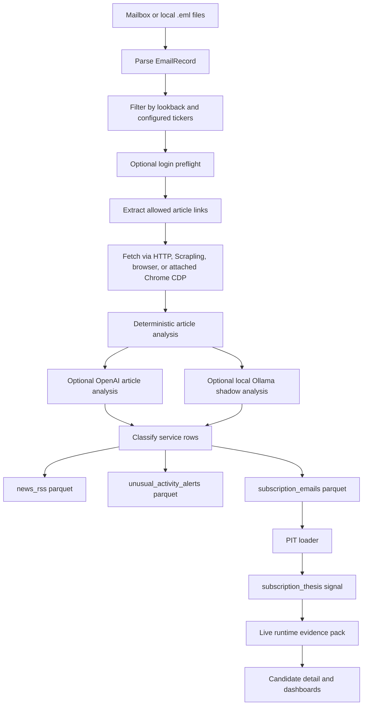
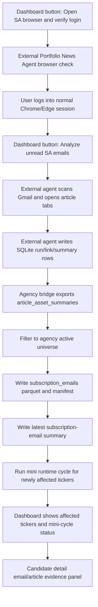

# Subscription Email And Article Evidence Audit

Date: 2026-05-31  
Repository: `C:\Users\meiri\trading_agency`  
Branch observed: `feat/ux-product-audit-20260529`  
Audience: product planning, implementation planning, QA, and operator workflow redesign

## 1. Executive Summary

The subscription email capability is no longer just a small parser. It is now a multi-agent evidence path with two parallel implementations:

1. Native Trading Agency subscription email ingest under `research/src/subscription_email`.
2. Integrated external Portfolio News Agent bridge under `src/agency/runtime/portfolio_news_agent_bridge.py`.

The external Portfolio News Agent bridge is currently the more operational Seeking Alpha path because it uses the tested email/article analyzer, reads its SQLite database, exports relevant article summaries into the agency's `subscription_emails` dataset, and can trigger ticker-scoped mini-cycles for affected stocks.

The native Trading Agency path still matters because it defines the canonical agency event schema, manifest, PIT loader, `subscription_thesis` signal, and dashboard status vocabulary. It also supports Zacks, TradeVision, deterministic article analysis, OpenAI article analysis, and local Ollama shadow analysis.

Current product verdict:

- The email/article evidence path is usable as context and review evidence.
- It is intentionally not allowed to approve trades, submit orders, or satisfy paper-trade gates by itself.
- It is not yet a fully trusted operator workflow because the login flow, progress state, article-level status, and "how this affected this stock" trace are still split across the dashboard, external agent DB, summary JSON, parquet rows, mini-cycle status, and candidate detail page.
- The strongest current gap is not raw extraction; it is trust and traceability. The user needs to see exactly which email was found, which article was opened, whether the login/session was valid, what the LLM concluded, which ticker(s) were affected, whether a mini-cycle ran, and how that changed the stock review.

High-priority product conclusion:

The next implementation should make email/article evidence a first-class, auditable, ticker-scoped evidence workflow:

`Login verified -> Emails scanned -> Article links opened -> LLM analysis complete -> Evidence synced -> Affected ticker mini-cycle complete -> Candidate page updated -> User can inspect impact`.

## 2. Scope

This audit reviews:

- Subscription email configuration and universe selection.
- Mailbox polling and `.eml` ingestion.
- Seeking Alpha, Zacks, and TradeVision service classification.
- Article link extraction, login-gated browser access, and article caching.
- Deterministic article sentiment/thesis extraction.
- OpenAI and local Ollama article-analysis paths.
- External Portfolio News Agent integration.
- Dataset writes into `news_rss`, `unusual_activity_alerts`, and `subscription_emails`.
- How email evidence reaches the PIT loader, `subscription_thesis`, live runtime, candidates, and dashboards.
- Display quality, progress visibility, ranking/scoring effect, and operator usability.

Out of scope for this document:

- Generic RSS ticker extraction, except where it overlaps with paid subscription email rows.
- Full execution preview UX, except where email evidence influences candidate decision trace.
- Live broker behavior.
- A live data run. This is a code and product audit artifact, not a claim that today's email agent is currently running.

## 3. Source Inventory

### 3.1 Native Agency Email Source

Primary files:

- `research/config/subscription-email.example.json`
- `research/src/subscription_email/config.py`
- `research/src/subscription_email/mailbox.py`
- `research/src/subscription_email/parser.py`
- `research/src/subscription_email/ingest.py`
- `research/scripts/import_subscription_emails.py`
- `research/scripts/watch_subscription_emails.py`

Supported modes:

- `local_eml`
- `gmail`
- `outlook`
- `imap`

Supported service families:

- `seeking_alpha`
- `tradevision`
- `zacks`

Key guardrails:

- Allowed sender domains.
- Configured ticker universe.
- Lookback window.
- Mailbox max messages.
- Article max links per email.
- Article max links per run.
- Optional mailbox mark-seen.
- Optional interactive article login preflight.
- Optional article LLM analysis.

Important code evidence:

- `SubscriptionEmailConfig` declares modes, services, article limits, login preflight, browser/CDP settings, cache TTL, and LLM settings in `research/src/subscription_email/config.py`.
- If `follow_article_links` is true and `seeking_alpha` is enabled, the loader forces `article_login_preflight_required=True` and includes `seeking_alpha` in preflight services in `research/src/subscription_email/config.py`.
- The native import writes progress to `research/results/latest-subscription-emails/subscription-email-progress.json` through `research/scripts/import_subscription_emails.py`.

### 3.2 External Portfolio News Agent Source

Primary files:

- `src/agency/runtime/portfolio_news_agent_bridge.py`
- `src/agency/runtime/email_evidence_refresh.py`
- `research/scripts/run_portfolio_news_agent_post_sync.py`
- `src/agency/runtime/scheduler_runner.py`

Default external root:

- `C:\Users\meiri\email news agent`

External agent database:

- Configured from the external agent `config.yaml`, usually `data/portfolio_news.db`.

External tables consumed by the agency bridge:

- `runs`
- `gmail_messages`
- `articles`
- `gmail_article_links`
- `article_asset_summaries`

The bridge exports external article summaries into:

- `research/data/parquet/subscription_emails.parquet`
- `research/data/manifests/subscription_emails.json`
- `research/results/latest-subscription-emails/subscription-email-ingest.json`
- `research/results/latest-subscription-emails/subscription-email-mini-cycle-status.json`

Important code evidence:

- `load_portfolio_news_agent_status()` reads external agent configuration and DB status.
- `export_portfolio_news_agent_events()` filters external article summaries to the agency active universe and writes the canonical subscription email dataset.
- `sync_email_evidence_and_run_mini_cycles()` syncs external evidence and runs ticker-scoped mini-cycles for newly affected tickers.
- `ensure_portfolio_news_agent_agency_config()` exports the agency active universe to the external agent and writes an overlay config with `telegram_enabled: false`.

## 4. Current End-To-End Data Flow

### 4.1 Native Trading Agency Flow



Native flow details:

- `ingest_subscription_email_config()` syncs mailbox content, parses records, filters records, runs login preflight, enriches records with linked content, classifies rows, writes outputs, and optionally marks selected mailbox emails seen.
- `enrich_records_with_linked_content()` handles link extraction, cache lookup, login-gated fetch, article analysis, status assignment, and cache persistence.
- `classify_subscription_emails()` converts enriched emails into `news_rss`, `unusual_activity_alerts`, and `subscription_emails` rows.
- `write_event_frame()` appends and deduplicates `subscription_emails` rows.
- `subscription_thesis_contexts()` reads only analyzed article rows and converts them to context-only signal scores.

### 4.2 Portfolio News Agent Bridge Flow



Bridge details:

- The app route `/scheduler/subscription-emails/login-refresh` launches the external agent browser check in a visible PowerShell window.
- The app route `/scheduler/subscription-emails/continue-after-login` launches the external agent email/article run.
- After a successful external run, the shell command runs `research/scripts/run_portfolio_news_agent_post_sync.py`.
- The post-sync script calls `sync_email_evidence_and_run_mini_cycles()`.
- Newly affected tickers run mini-cycles with `--signal subscription_thesis --signal news`.

## 5. Agent And Process Inventory

### 5.1 Config Loader

Goal:

- Define what email sources are allowed, how many emails/articles may be processed, which tickers are in scope, which browser mode is used, and which LLM provider is enabled.

Code:

- `research/src/subscription_email/config.py`
- `research/config/subscription-email.example.json`

Inputs:

- JSON config.
- Environment variables for mailbox credentials and LLM configuration.

Outputs:

- `SubscriptionEmailConfig`.

Real data connection:

- Yes, if local config points to real mailbox credentials or real local `.eml` exports.
- The example config is not production-ready because it contains only `AAPL`, `MSFT`, `NVDA` as tickers.

Audit notes:

- Positive: validation rejects unknown services, invalid modes, invalid LLM providers, and unsafe article limits.
- Positive: Seeking Alpha link opening forces login preflight when `follow_article_links` is enabled.
- Risk: the native config still depends on a configured ticker list. If this is not generated from the agency active universe, it can repeat the old "pre-determined portfolio list" problem.
- Risk: `article_max_total_per_run` defaults to `5` in the example config. That is safe for tests but not aligned with the user's desired normal-day volume of about 50 emails/articles.

### 5.2 Mailbox Sync Agent

Goal:

- Pull authorized subscription emails from local `.eml`, Gmail, Outlook, or IMAP.

Code:

- `research/src/subscription_email/mailbox.py`
- `research/src/subscription_email/ingest.py`
- `research/src/subscription_email/monitor.py`

Inputs:

- Mailbox label/search settings.
- Local email export folder.
- Environment-provided mailbox credentials.

Outputs:

- `.eml` files in the ignored local data folder.
- `EmailRecord` objects.
- Mailbox sync metadata in summaries and progress state.

Real data connection:

- Yes, if configured in `gmail`, `outlook`, or `imap` mode.

Audit notes:

- Positive: native ingest can process only selected newly saved mailbox files, avoiding whole-folder reprocessing.
- Positive: default `mailbox_mark_seen` is false.
- Risk: if `mailbox_mark_seen` is enabled, selected UIDs are marked seen after the ingest step, not only after every article link is successfully opened and analyzed. This could hide failed article runs from the user's inbox workflow.

### 5.3 Email Parser

Goal:

- Parse `.eml` into safe metadata and text while preserving article links.

Code:

- `research/src/subscription_email/parser.py`
- Tests in `tests/unit/test_subscription_email_agents.py`

Inputs:

- `.eml` files.

Outputs:

- `EmailRecord` with sender, sender domain, subject, received time, body text, and source path.

Privacy and safety:

- Raw bodies are not written to summary artifacts.
- Message IDs are hashed in output rows.
- Article title and text are hashed in canonical article evidence.

Audit notes:

- Positive: tests verify HTML hrefs are preserved and scripts are stripped.
- Positive: summaries explicitly avoid raw article/body text.

### 5.4 Login Preflight And Browser Article Access

Goal:

- Prevent the agent from opening paid article links before the user has logged in and acknowledged that the session is usable.

Code:

- `research/src/subscription_email/article_session.py`
- `research/scripts/import_subscription_emails.py`
- `src/agency/runtime/scheduler_runner.py`

Modes:

- Persistent Playwright browser profile.
- Installed Chrome/Edge channel.
- Attached regular Chrome through CDP at `article_browser_cdp_url`.

Critical behavior:

- `ensure_interactive_article_login()` opens provider login pages and waits for user acknowledgment.
- Attached Chrome mode tries to connect to an existing CDP endpoint, or starts regular installed Chrome with remote debugging.
- `_start_cdp_browser()` uses installed Chrome/Edge, `--new-window`, and only uses a dedicated profile if `AGENCY_ARTICLE_LOGIN_DEDICATED_PROFILE=true`.
- `_assert_provider_login_confirmed()` verifies the login with a selected article link when available.

Audit notes:

- Positive: the current code is aligned with the user's requirement that Seeking Alpha should use normal installed Chrome/Edge and should not begin article analysis before login acknowledgment.
- Positive: the dashboard exposes separate login refresh and continue-after-login routes.
- Risk: the actual operator state still depends on a visible PowerShell window and an external browser/CDP session. If the shell is closed or the external agent prompts unexpectedly, the app may not show enough detail to recover.
- Risk: browser readiness is inferred from CDP reachability and external DB state. The dashboard should separately show "browser reachable", "login verified", "article currently opening", and "article analysis complete".

### 5.5 Link Extraction And Linked Content Enrichment

Goal:

- Select safe article links from email content, avoid tracking/sensitive URLs, fetch article text, analyze it, and attach normalized linked-content fields to `EmailRecord`.

Code:

- `research/src/subscription_email/linked_content.py`

Inputs:

- `EmailRecord`
- `SubscriptionEmailConfig`
- Optional fetcher/analyzer/test doubles

Outputs:

- Enriched `EmailRecord` with:
  - `linked_content_status`
  - `linked_content_url`
  - `linked_content_title_hash`
  - `linked_content_direction`
  - `linked_content_thesis`
  - `linked_content_catalysts`
  - `linked_content_risk_flags`
  - `linked_content_key_points`
  - `linked_content_tickers`
  - `linked_content_decision_use`
  - `linked_content_signal_strength`
  - `linked_content_confidence`
  - local LLM shadow fields

Status taxonomy:

- `article_analyzed`
- `article_analyzed_deterministic_fallback`
- `article_login_required`
- `article_login_preflight_required`
- `article_unavailable`
- `no_allowed_article_link`
- `non_universe_ticker_email`
- `no_configured_ticker_in_email`
- `login_or_security_email`
- `article_fetch_limited`

Audit notes:

- Positive: link extraction removes sensitive query keys and tracking keys.
- Positive: article cache is model-aware for OpenAI and local Ollama analysis, so old deterministic cache entries are ignored when LLM analysis is enabled.
- Positive: non-universe ticker emails can be skipped before opening protected article links.
- Risk: article fetch exceptions are collapsed into broad status values. The dashboard often cannot tell whether the failure was HTTP, bot challenge, selector/readability failure, network timeout, login, or article limit.
- Risk: native linked-content status has no durable article-by-article progress ledger. It reports aggregate counts, while the external Portfolio News Agent DB has per-link status.

### 5.6 Deterministic Article Analyzer

Goal:

- Produce a fallback article direction, catalyst/risk taxonomy, thesis, decision-use text, and signal strength without calling an LLM.

Code:

- `research/src/subscription_email/article_analysis.py`

Method:

- Count positive and negative keyword terms.
- Detect catalyst terms:
  - `quant_rating`
  - `analyst_rating`
  - `earnings`
  - `rank_change`
  - `unusual_activity`
- Detect risk terms:
  - `negative_revision`
  - `valuation`
  - `macro`
  - `legal_or_regulatory`
  - `execution`
- Build a generic thesis and key points.

Audit notes:

- Positive: deterministic fallback is useful when LLM is unavailable.
- Risk: keyword direction is not deep sentiment analysis. It can misread negation, sarcasm, valuation articles, balanced articles, and "upgrade but expensive" cases.
- Risk: deterministic fallback currently has no confidence field in the native analyzer output; downstream confidence usually comes from classifier-level confidence.
- Product implication: deterministic fallback should be clearly labeled as "keyword-only" and should not be displayed as equal to a full article read.

### 5.7 OpenAI Article Analyzer

Goal:

- Convert article text into a supervised ticker-specific JSON schema.

Code:

- `research/src/subscription_email/article_llm_analysis.py`

Required output fields:

- `direction`
- `confidence`
- `tickers`
- `thesis`
- `key_points`
- `catalysts`
- `risk_flags`
- `decision_use`
- `signal_strength`

Current limits:

- OpenAI path sends up to `min(config.article_max_chars, 5000)` article characters.
- The example config allows `article_max_chars=12000`, but the OpenAI analyzer hard-caps the LLM prompt at 5000 characters.

Audit notes:

- Positive: schema-constrained JSON reduces parser failures.
- Positive: allowed categories are controlled.
- Risk: 5000 characters can miss the article's central evidence, especially for long Seeking Alpha analysis pieces with valuation tables, risks, management commentary, and bull/bear sections.
- Risk: the prompt is compact and does not demand hard evidence, numeric facts, valuation changes, time period, or thesis-vs-risk separation at the depth the user wants.
- Product implication: the next version should use a two-stage prompt:
  1. Extract structured facts and cited claim snippets from a larger article context.
  2. Convert extracted facts into ticker-specific bullish/bearish/neutral evidence with confidence and reason.

### 5.8 Local Ollama Article Analyzer

Goal:

- Use the Raspberry Pi local model as a shadow-only article reader.

Code:

- `research/src/subscription_email/article_llm_analysis.py`
- `src/agency/runtime/local_llm.py`
- `scripts/check_local_llm.py`

Current limits:

- Local Ollama article context is capped at 900 characters.
- It is explicitly shadow-only.
- `local_llm_article_can_affect_trade_gates` is always false.

Audit notes:

- Positive: local LLM cannot approve, block, promote, submit, or feed `subscription_thesis`.
- Positive: candidate detail can display local LLM article comparison when present.
- Risk: 900 characters is too short for meaningful Seeking Alpha article analysis.
- Risk: if the local LLM result is shown beside deterministic evidence, the UI must clearly say it is advisory and not score-impacting.
- Product implication: local LLM should be used for low-cost extended extraction and QA, but not trading influence until repeated quality review passes.

### 5.9 Classifier Agent

Goal:

- Convert emails and linked article analysis into normalized rows for agency datasets.

Code:

- `research/src/subscription_email/classifiers.py`

Outputs:

- `news_rss` rows for Seeking Alpha, Zacks, and non-alert TradeVision emails.
- `unusual_activity_alerts` rows for TradeVision dark-pool/block/options/unusual-stock alerts.
- `subscription_emails` event rows for paid email/article thesis context.

Key classifier behavior:

- Service is inferred from sender domain and subject.
- Tickers are matched only from configured tickers.
- Ambiguous tickers require explicit syntax.
- TradeVision alert types detect dark pool, block trade, options sweep, unusual options activity, and unusual stock activity.
- Direction uses linked article direction if present; otherwise keyword direction.
- Confidence base:
  - TradeVision: 0.85
  - Rating/rank events: 0.80
  - Other events: 0.70
  - Analyzed article can raise confidence.

Ticker-specific safeguards:

- An analyzed article with no material ticker match becomes `article_analyzed_no_ticker_match`.
- A portfolio/theme article without ticker-specific claims becomes `article_analyzed_portfolio_context_only`.
- Secondary headline focus is labeled as secondary/basket/theme context.
- Peer-comparison boilerplate is not promoted to direct ticker thesis.

Audit notes:

- Positive: recent tests cover important false-positive cases, including ambiguous tickers, secondary headline focus, and portfolio-context-only article rows.
- Positive: event dedupe merges cross-provider events by ticker and URL.
- Risk: the configured ticker list is still the gating universe for the native path. If config is not regenerated from the agency active universe, emails for the 168-stock universe can be missed.
- Risk: the classifier's confidence model is simple and not calibrated to article quality, source type, article recency, article length analyzed, or LLM/deterministic quality.

### 5.10 Storage And Manifest Writer

Goal:

- Append canonical event rows, dedupe them, and write manifest/source health artifacts.

Code:

- `research/src/subscription_email/storage.py`

Outputs:

- `subscription_emails.parquet`
- `subscription_emails.json`
- `subscription-email-ingest.json`
- `subscription-email-ingest.md`

Manifest behavior:

- `SUBSCRIPTION_EMAIL_STALE_AFTER = timedelta(hours=4)`
- Manifest contains row count, checksum, `fetched_at`, `max_timestamp_as_of`, and `stale_after`.

Audit notes:

- Positive: the event schema includes detailed linked-content and local LLM shadow fields.
- Positive: dedupe key normalizes article URL by ticker.
- Risk: `write_event_frame()` returns `len(frame)`, not final persisted row count. This mirrors an earlier class of write-count bugs and should be reviewed for logging accuracy if callers trust it.
- Risk: row-level "used in runtime cycle" or "consumed once" status is not present. The same analyzed article can continue to appear in `subscription_thesis` for the full lookback window.

### 5.11 PIT Loader And Subscription Thesis Signal

Goal:

- Turn analyzed subscription article evidence into ticker-level context signals.

Code:

- `research/src/pit/forward_views.py`
- `research/src/signals/subscription_thesis.py`
- `research/src/live_runtime/signals.py`
- `src/agency/runtime/lane_promotion.py`

Current scoring:

- Lookback: default 10 days.
- Accepted link statuses:
  - `article_analyzed`
  - `article_analyzed_deterministic_fallback`
- Excluded statuses:
  - `article_analyzed_no_ticker_match`
  - `article_analyzed_portfolio_context_only`
  - login-required/failed/pending/headline-only rows
- Direction score:
  - `BULLISH`: `+0.65`
  - `BEARISH`: `-0.65`
  - `NEUTRAL`: `0.0`
  - `MIXED`: `0.0`
- Event score:
  - direction score times event confidence.
- Recency:
  - events are sorted newest first.
  - weights use `RECENCY_DECAY = 0.65`, so the newest event has weight 1.0, the next 0.65, then 0.4225, etc.
- Output:
  - score clipped to `[-1.0, 1.0]`.
  - summary shows up to 3 newest analyzed article theses.

Agency effect:

- In live runtime, subscription thesis produces signal results with:
  - `reason_codes=["subscription_thesis_context_only"]`
  - `actionability="CONTEXT_ONLY"`
- In lane promotion policy, `subscription_thesis` is `CONTEXT_ONLY`.

Product meaning:

- Email/article analysis can explain a candidate and influence human review understanding.
- It should not independently push a stock into paper execution.
- It can become stronger later only after validation and explicit policy change.

Audit notes:

- Positive: old averaging bug was fixed with recency weighting.
- Positive: loader bugs are no longer swallowed except `DataNotAvailableAt`; tests verify runtime bugs propagate.
- Risk: scoring ignores article-specific quality dimensions such as direct headline focus, full article vs deterministic fallback, source credibility, LLM confidence vs classifier confidence, article body coverage, catalyst materiality, and whether the article is a repeated digest.
- Risk: deterministic fallback rows are accepted by `subscription_thesis` with the same status family as full article rows. They need lower weight or explicit quality penalty.

### 5.12 Candidate Detail Display

Goal:

- Show ticker-level email/article evidence in a way that helps user review.

Code:

- `src/agency/views/candidates.py`
- `src/agency/templates/candidate_detail.html`

Displayed fields:

- Matched emails.
- Feed rows.
- Article analysis count.
- Services.
- Direction pills.
- Judgment impact.
- Pipeline use.
- Coverage quality.
- Matched/opened/summarized/score-impact mini pipeline.
- Article insight cards.
- Local Pi LLM shadow comparison.
- Paired mailbox alert vs agency interpretation rows.

Audit notes:

- Positive: the candidate page has a dedicated `Email/article evidence` panel.
- Positive: the page distinguishes article thesis, keyword-only thesis, no ticker match, failed/open-limited/headline-only rows.
- Positive: local LLM shadow result is visually separated and says it cannot approve, block, promote, or submit a trade.
- Risk: "Score impact" displays feed-row count and latest time, but the actual runtime effect is context-only. The wording can imply a stronger scoring role than current policy allows.
- Risk: detailed article evidence is inside a collapsed section. For a ticker where email evidence is the main reason to review, the important facts may be hidden.
- Risk: article cards still rely on generated summaries and taxonomy labels. They do not always show the concrete article facts the user wants: what changed, what number, what period, what management/fundamental claim, why bullish/bearish.

### 5.13 Command Dashboard Display

Goal:

- Show email/article pipeline status, login requirement, progress, affected tickers, and mini-cycle status.

Code:

- `src/agency/runtime/data_load_status.py`
- `src/agency/views/command.py`
- `src/agency/templates/dashboard.html`
- `src/agency/templates/_data_health.html`

Displayed fields:

- Status label.
- Detail.
- Progress label and progress bar.
- Emails selected.
- Article links found.
- Opened/analyzed.
- In progress now.
- LLM stock summaries.
- Needs login.
- Failed/skipped.
- Last update.
- Current action.
- Current article URL.
- Affected tickers.
- Mini-cycle ticker statuses.
- Login refresh button.
- Continue-after-login button.

Audit notes:

- Positive: the command dashboard now has meaningful email/article progress elements.
- Positive: `command.py` converts `updated_at` into `last_update_label`.
- Risk: the section is conditional. When inactive, it may disappear, which is good for clutter but bad if the user is specifically looking for "what happened to the last email run." A compact historical status should remain discoverable.
- Risk: status is split between native progress JSON and Portfolio News Agent DB. The app chooses the Portfolio News Agent status if that agent is configured. This needs to be explicit in the UI: "Source: Portfolio News Agent DB" vs "Source: Native subscription email ingest".

## 6. How Email Evidence Affects The Agency Today

### 6.1 What It Can Affect

Email/article evidence can affect:

- Candidate detail explanation.
- Reviewer's understanding of bullish/bearish context.
- `subscription_thesis` signal score, as context-only.
- News context via paid-email rows written to `news_rss`.
- TradeVision activity context via `unusual_activity_alerts`.
- Affected ticker mini-cycles after Portfolio News Agent sync.

### 6.2 What It Cannot Affect

Email/article evidence currently cannot:

- Approve a paper trade.
- Submit a paper order.
- Override a risk gate.
- Promote a stock by itself.
- Satisfy execution readiness by itself.
- Let local Ollama shadow output affect trade gates.

### 6.3 Current Ranking/Scoring Model

Native event confidence:

- Base confidence from service/event type.
- Full article analysis can raise confidence.
- Direction is from linked article direction when available, else keyword direction.

`subscription_thesis` score:

- Only analyzed article statuses are included.
- Each event is mapped to direction score times confidence.
- Newer events receive exponentially higher weight.
- Score is context-only.

Candidate display:

- Direction counts show bullish/bearish/neutral email history.
- Primary takeaway summarizes latest/strongest article or headline context.
- Judgment contribution compares the email evidence to the current latest report.

Critical product caveat:

The current scoring is simple and not yet "investment-grade article analysis." It is adequate as a supervised review context layer, not as a standalone recommendation engine.

## 7. Positive Controls Already Present

1. Login preflight exists and is forced for Seeking Alpha when article links are enabled.
2. Attached normal Chrome/Edge CDP flow exists.
3. Native raw article text is analyzed in memory and not stored in summaries/parquet.
4. Message IDs and article titles are hashed.
5. Sensitive/tracking URL query parameters are stripped.
6. Local Ollama article analysis is shadow-only.
7. Native classifier filters no-ticker and portfolio-context-only articles out of `subscription_thesis`.
8. External Portfolio News Agent bridge filters imported article summaries to the agency active universe.
9. External agent overlay disables Telegram without mutating the user's original external config.
10. Post-sync mini-cycle can run only affected tickers instead of re-running the whole universe.
11. Dashboard has login refresh and continue-after-login actions.
12. Candidate page includes a dedicated email/article evidence panel.

## 8. Major Findings

### F-SE-001 [P0] Native config can still use a static ticker list

Evidence:

- `research/config/subscription-email.example.json` contains only `AAPL`, `MSFT`, `NVDA`.
- Native classifier matches only configured tickers.
- Portfolio News Agent bridge exports the agency active universe, but the native path does not automatically load the active universe unless the local config is maintained.

Impact:

- Emails related to the agency's 168-stock universe can be ignored if the native config is not updated.
- This can recreate the old residue from the original standalone portfolio agent.

Recommended fix:

- Add a shared active-universe resolver for subscription email config.
- When native email ingest runs inside the agency, ignore static config tickers unless an explicit override is set.
- Write a status artifact showing `email_universe_source=agency_active_universe`, `ticker_count=168`, sample tickers, and generated timestamp.

Definition of done:

- Native ingest and Portfolio News Agent overlay both use the same active universe.
- Dashboard shows the source and count of tickers used for email analysis.
- Tests prove an in-universe ticker outside the example JSON is analyzed.

### F-SE-002 [P0] Email workflow source of truth is split

Evidence:

- Native progress is `subscription-email-progress.json`.
- Native summary is `subscription-email-ingest.json`.
- Portfolio News Agent status is read from external SQLite.
- Mini-cycle status is `subscription-email-mini-cycle-status.json`.
- Dashboard chooses Portfolio News Agent status if it is configured.

Impact:

- The user cannot easily tell which agent produced the visible status.
- The app can show "email evidence analyzed" while the native summary says something else, or vice versa.

Recommended fix:

- Create one canonical `email_evidence_state.json` written by both paths.
- Include:
  - `source_agent`
  - `run_id`
  - `run_state`
  - `browser_state`
  - `login_verified_at`
  - `email_scan_started_at`
  - `email_scan_finished_at`
  - `article_counts`
  - `current_article`
  - `affected_tickers`
  - `mini_cycle_state`
  - `last_success_at`
  - `last_failure`
  - `dashboard_summary`

Definition of done:

- Dashboard, cockpit, data health, and candidate page all read the same canonical state object.
- UI shows "Source: Portfolio News Agent" or "Source: Native email ingest" clearly.

### F-SE-003 [P0] Article-level progress needs first-class dashboard visibility

Evidence:

- Portfolio News Agent DB has per-link statuses.
- Native linked-content enrichment has aggregate statuses.
- Dashboard shows aggregate counts and current URL, but not a full per-article run list.

Impact:

- User cannot audit: "Which email did you open? Which article was analyzed? Which failed? Which ticker did it affect?"
- This was a direct pain point in previous manual testing.

Recommended fix:

- Add an email/article run detail endpoint and panel:
  - email subject hash/display-safe headline
  - provider
  - article URL domain/path
  - status
  - opened_at
  - analyzed_at
  - LLM model
  - extracted tickers
  - direction
  - confidence
  - mini-cycle result

Definition of done:

- After a run, the user can open one panel and see every article's state without checking PowerShell or SQLite.

### F-SE-004 [P0] OpenAI and local LLM article context limits are too small for the intended product

Evidence:

- OpenAI article prompt caps body text at 5000 characters.
- Local Ollama prompt caps article text at 900 characters.

Impact:

- Long Seeking Alpha articles can be summarized from only the intro and miss the investment thesis, valuation facts, risk section, or conclusion.
- The UI may show a confident summary that is based on incomplete article context.

Recommended fix:

- Implement multi-part article extraction:
  - section detection
  - chunked fact extraction
  - final ticker-specific synthesis
  - explicit "article coverage" metric, for example `analyzed_chars/original_chars`.
- Raise local LLM context or use map/reduce chunking for local models.
- Display "Analyzed X of Y article characters" in the candidate evidence panel.

Definition of done:

- 50-email test run can process article bodies with coverage metadata.
- Candidate page shows article coverage and whether the analysis was full, partial, or keyword-only.

### F-SE-005 [P0] Email evidence can be reused for multiple cycles without explicit consumed/used state

Evidence:

- `subscription_thesis` reads analyzed rows within the lookback window.
- No row-level `used_in_cycle`, `last_used_at`, or `consumption_state` exists for `subscription_emails`.
- News has a consumption concept elsewhere, but subscription email does not have an equivalent lifecycle.

Impact:

- A single article can influence context repeatedly for up to the lookback window.
- The operator cannot tell whether a piece of email evidence is new today or just still inside the lookback window.

Recommended fix:

- Add subscription email evidence lifecycle:
  - `first_seen_at`
  - `article_analyzed_at`
  - `first_used_in_cycle`
  - `last_used_in_cycle`
  - `use_count`
  - `fresh_for_review_until`
  - `is_new_since_last_review`
- Candidate page should separate:
  - New since last review.
  - Still relevant from previous cycle.
  - Expired/archived.

Definition of done:

- A repeat runtime cycle does not make old email evidence look newly discovered.
- User can see why an old article is still shown.

### F-SE-006 [P1] `subscription_thesis` scoring is too coarse for article quality

Evidence:

- Direction scores are fixed at `+0.65`, `-0.65`, or `0`.
- Recency weighting is applied, but direct relevance, article quality, LLM provider, deterministic fallback, source, and coverage depth are not weight inputs.

Impact:

- A short keyword-only fallback can have similar scoring weight to a high-quality full LLM article summary.
- Secondary theme articles can still look meaningful in summaries even when context-only.

Recommended fix:

- Introduce an evidence quality multiplier:
  - full LLM article, direct ticker thesis: 1.00
  - full LLM article, secondary ticker context: 0.40
  - deterministic fallback: 0.25
  - headline-only: 0.00 for `subscription_thesis`
  - local LLM shadow: 0.00 until validation
- Add explicit `quality_score`, `relevance_score`, and `analysis_depth_score`.

Definition of done:

- `subscription_thesis` summary includes why each article was weighted.
- Tests prove deterministic fallback has lower effect than full direct article thesis.

### F-SE-007 [P1] Candidate page wording still risks implying score impact stronger than policy allows

Evidence:

- Candidate panel has a pipeline step labeled "Score impact".
- Runtime and lane policy mark `subscription_thesis` as context-only.

Impact:

- User may think email evidence directly changes trade eligibility.

Recommended fix:

- Rename "Score impact" to "Agency use".
- Display one of:
  - "Context only"
  - "Corroborates existing signal"
  - "New since last review"
  - "Not used: article not analyzed"
- If it appears in the signal list, show "Context-only signal, not an execution gate."

Definition of done:

- No email/article UI label implies trade eligibility unless the policy actually allows it.

### F-SE-008 [P1] Concrete article facts are not always surfaced

Evidence:

- Candidate card summaries rely on thesis/key-points/catalyst/risk text.
- Deterministic analyzer produces generic taxonomy labels.
- Portfolio News Agent bridge exports `short_summary`, sentiment, theme, relevance, and confidence, but not structured fact rows.

Impact:

- User sees generic wording instead of "what changed, by how much, over what period, and why it matters."

Recommended fix:

- Extend article schema with:
  - `fact_claims`
  - `financial_metrics`
  - `valuation_claims`
  - `management_guidance_claims`
  - `risk_claims`
  - `evidence_quotes_short`
  - `time_periods`
  - `article_conclusion`
- Candidate UI should show top 3 concrete facts before generic thesis text.

Definition of done:

- For a real SA article, the candidate page shows at least three concrete extracted facts, not just labels.

### F-SE-009 [P1] Error taxonomy is not actionable enough

Evidence:

- Native article fetch failures collapse into broad statuses like `article_unavailable` or `article_login_required`.
- Portfolio News Agent statuses are more detailed but still summarized in broad dashboard labels.

Impact:

- User cannot distinguish provider login, bot challenge, network timeout, extraction failure, LLM failure, article irrelevant, or article outside universe.

Recommended fix:

- Standardize error categories:
  - `browser_not_connected`
  - `login_not_verified`
  - `provider_challenge`
  - `article_http_error`
  - `article_readability_failed`
  - `article_not_relevant`
  - `llm_timeout`
  - `llm_schema_error`
  - `outside_agency_universe`
  - `article_limit_reached`
- Dashboard should show a plain-English reason and exact user action.

Definition of done:

- Every failed article link has a reason category and next action.

### F-SE-010 [P1] Telegram residue still exists in status taxonomy

Evidence:

- `TERMINAL_FAILED` in `portfolio_news_agent_bridge.py` includes `failed_telegram`.
- The bridge overlay disables Telegram in external agent run config.

Impact:

- Dashboard or status counts can still mention an irrelevant Telegram failure if the external DB contains that state.
- User explicitly requested removal of Telegram-related issues.

Recommended fix:

- Remove Telegram from agency-facing status vocabulary.
- Map external `failed_telegram` to an ignored/non-actionable external-residue state, or clean it before displaying.

Definition of done:

- No operator-facing dashboard, status JSON, or audit summary asks the user to act on Telegram.

### F-SE-011 [P1] Native mailbox mark-seen can hide failed article processing if enabled

Evidence:

- `ingest_subscription_email_config()` marks selected UIDs seen after output writing when `mailbox_mark_seen` is true.
- It does not require `linked_content_succeeded == attempted`.

Impact:

- If enabled, a protected article could fail, yet the message could be marked seen.

Recommended fix:

- Add `mailbox_mark_seen_policy`:
  - `never`
  - `after_email_saved`
  - `after_article_analyzed`
  - `after_terminal_status`
- Default should remain safe.

Definition of done:

- Tests prove failed-login or failed-article messages are not marked seen under the operational policy.

### F-SE-012 [P1] External run shell still depends on PowerShell process lifecycle

Evidence:

- `scheduler_runner.py` launches a new PowerShell window for login refresh and article analysis.
- The shell script ends with `Read-Host`.

Impact:

- The operator may think the dashboard controls the run, but completion/closure still depends on the shell.
- If the external agent prompts per article, the dashboard cannot resolve that state by itself.

Recommended fix:

- Keep visible shell for transparency, but make it non-authoritative.
- Add a dashboard polling loop against the canonical email evidence state.
- Add "run finished" and "safe to close window" status in the dashboard.

Definition of done:

- The user does not need to inspect PowerShell to know whether email analysis is complete.

### F-SE-013 [P2] Native and external article schemas are not unified

Evidence:

- Native schema stores `linked_content_*` and `local_llm_article_*`.
- External bridge maps `article_asset_summaries` into `linked_content_*`, but source fields are different.

Impact:

- Some details from the external agent may be lost or flattened.
- UI cannot reliably know whether an article came from native OpenAI, deterministic fallback, local Ollama, or external agent LLM.

Recommended fix:

- Add canonical fields:
  - `analysis_provider`
  - `analysis_model`
  - `analysis_prompt_version`
  - `analysis_method`
  - `analysis_depth`
  - `analysis_source_agent`
  - `article_coverage_percent`

Definition of done:

- Candidate article card shows method/model/source consistently for native and external rows.

### F-SE-014 [P2] Status copy still uses mixed agent/process terms

Evidence:

- UI labels include "Portfolio News Agent", "Email/article agent", "subscription thesis", "feed rows", and "mini-cycle".

Impact:

- Operator has to learn implementation terms.

Recommended fix:

- Use operator wording:
  - "Email reader"
  - "Article reader"
  - "Stock summary update"
  - "Used as context"
  - "Needs login"
  - "Ready for review"
- Keep internal terms in tooltips or audit details only.

Definition of done:

- The main dashboard path is understandable without knowing agent names.

### F-SE-015 [P2] No quality dashboard for article-analysis accuracy

Evidence:

- Tests verify schema and some false positives.
- There is no ongoing quality sample, confusion matrix, or human correction capture for LLM article sentiment.

Impact:

- The team cannot decide when local Ollama or email evidence should graduate from context-only.

Recommended fix:

- Add a weekly article-analysis QA set:
  - 25 Seeking Alpha articles
  - expected tickers
  - expected direction
  - expected relevance
  - expected key facts
  - model output comparison
  - human review correction

Definition of done:

- Dashboard shows article-analysis quality trend and validation status.

## 9. Recommended Implementation Backlog

### Ticket SE-01 [P0] Canonical Email Evidence State Registry

Goal:

- Build one normalized state file/API for email evidence status.

Implementation:

- Add `src/agency/runtime/email_evidence_state.py`.
- Read native progress, native summary, external Portfolio News Agent DB, and mini-cycle status.
- Normalize into one schema.
- Update `data_load_status.py`, Command dashboard, Cockpit data health, and candidate page to consume this object.

Definition of done:

- One status object explains login, scan, article, LLM, sync, mini-cycle, and last-success state.
- Tests cover native-only, Portfolio News Agent, running, login-needed, failed-link, and completed states.

### Ticket SE-02 [P0] Active Universe Contract For Email Agents

Goal:

- Guarantee email analysis uses the agency's current 168-stock universe, not a stale static portfolio list.

Implementation:

- Add `load_email_evidence_universe(as_of)` helper.
- Native ingest overrides config tickers in agency-run mode.
- Portfolio News Agent export and run config already have a universe export; make the status visible and test it.

Definition of done:

- Both native and external paths report the same universe count and sample tickers.
- Tests prove an active ticker not in the example JSON can be analyzed.

### Ticket SE-03 [P0] Article Run Ledger And Dashboard Detail

Goal:

- Make every email/article link traceable.

Implementation:

- Add `email_article_run_rows` to state registry.
- For external agent, read from SQLite.
- For native agent, write a JSONL progress ledger during enrichment.
- Add dashboard details panel.

Definition of done:

- User can see every link's state, status reason, ticker mapping, direction, confidence, and mini-cycle result.

### Ticket SE-04 [P0] Larger Article Analysis With Fact Extraction

Goal:

- Replace shallow prompt body limits with chunked fact extraction and synthesis.

Implementation:

- Add article section extraction.
- Add map/reduce LLM workflow.
- Expand schema with concrete facts and evidence coverage.
- Increase local Ollama path through chunking instead of one 900-character prompt.

Definition of done:

- Real article test shows concrete facts, article coverage, and final thesis.
- Candidate page displays facts before generic summary.

### Ticket SE-05 [P1] Email Evidence Lifecycle And Consumption

Goal:

- Distinguish new evidence from still-relevant old evidence.

Implementation:

- Add lifecycle fields to `subscription_emails` rows or sidecar ledger.
- Update `subscription_thesis` and candidate display.

Definition of done:

- Candidate page marks "new since last review" vs "carried from prior cycle".

### Ticket SE-06 [P1] Quality-Weighted Subscription Thesis

Goal:

- Penalize deterministic/secondary/partial article reads and reward direct full article thesis.

Implementation:

- Add `analysis_quality_score`.
- Add `ticker_relevance_score`.
- Add `article_depth_score`.
- Multiply score by quality.

Definition of done:

- Tests prove direct full article > deterministic fallback > secondary theme > headline-only.

### Ticket SE-07 [P1] Operator Copy Cleanup For Email Evidence

Goal:

- Make every displayed email status plain and actionable.

Implementation:

- Rename "Score impact".
- Add "What this means for this stock" with concrete evidence.
- Add "What to do next" for pending/login/failure rows.

Definition of done:

- No generic "context only" paragraph appears without a concrete reason.

### Ticket SE-08 [P1] Remove Telegram From Agency-Facing Status

Goal:

- Eliminate irrelevant Telegram failures from the Trading Agency UX.

Implementation:

- Normalize `failed_telegram` as ignored external residue.
- Keep external overlay `telegram_enabled: false`.
- Add dashboard scan test.

Definition of done:

- No Telegram text appears in operator dashboards or readiness summaries.

### Ticket SE-09 [P2] Article Analysis Quality Dashboard

Goal:

- Track whether the article reader is reliable enough to graduate beyond context-only.

Implementation:

- Add sampled review set and scoring.
- Store human correction feedback.
- Show quality trend.

Definition of done:

- User can inspect model accuracy over time.

## 10. QA Plan For Later Implementation

### Unit Tests

Run:

```powershell
.\.venv\Scripts\python -m pytest tests\unit\test_subscription_email_agents.py tests\unit\test_subscription_thesis_signal.py tests\unit\test_portfolio_news_agent_bridge.py -q
```

Required new test cases:

- Native config uses agency active universe.
- Login-needed article writes actionable canonical state.
- External agent DB rows map to canonical state.
- Article ledger includes per-link status.
- Deterministic fallback is lower weight than full LLM article.
- Local Ollama remains shadow-only.
- Telegram residue is not operator-visible.
- Same article is not presented as newly discovered after repeat cycle.

### Integration Tests

Run:

```powershell
.\.venv\Scripts\python research\scripts\run_portfolio_news_agent_post_sync.py --run-mini-cycles
.\.venv\Scripts\python scripts\check_local_runtime.py --min-selection-reports 1 --min-risk-decisions 1
```

Add integration smoke:

- Start login refresh.
- Verify browser state is `login_waiting`.
- Confirm login.
- Run email article analysis.
- Verify articles show `processing`, then `processed_relevant` or terminal failure.
- Verify affected tickers show mini-cycle status.
- Open candidate page for one affected ticker and confirm article facts display.

### UX QA

Manual path to verify after implementation:

1. Open Command dashboard.
2. Click email login refresh.
3. Confirm the app says exactly what the user should do.
4. Log into Seeking Alpha in regular installed Chrome/Edge.
5. Click continue/analyze.
6. Watch progress:
   - emails found
   - article links found
   - current article
   - LLM status
   - affected tickers
   - mini-cycle status
7. Open an affected candidate page.
8. Verify the page shows:
   - article headline/domain
   - article timestamp
   - analysis model/source
   - concrete extracted facts
   - bullish/bearish interpretation
   - whether it is new since last review
   - whether it is context-only or score-impacting

### Data Integrity QA

Checks:

- No raw paid article body text in parquet or summary JSON.
- No plaintext message IDs in parquet or summary JSON.
- No static example ticker universe in production state.
- No Telegram operator-visible state.
- No failed-login article marked as analyzed.
- No old article shown as newly discovered.

## 11. Product Recommendation

The email/article agent should become a supervised evidence reader, not a silent background source.

The user-facing mental model should be:

1. The app asks the user to log in when paid article access is needed.
2. The user confirms login in the same normal browser session.
3. The app opens the selected articles.
4. The app explains what each article said, which ticker it affects, and why.
5. The app updates only those affected stock reviews.
6. The app marks whether the evidence is new, carried forward, failed, or ignored.
7. The app never lets email/article evidence alone trade without corroboration and explicit policy change.

This will preserve the safety posture while making the process understandable enough for semi-automatic operation.

## 12. Bottom Line

The current code has strong foundations: source filtering, login preflight, normal Chrome/CDP support, schema-normalized article rows, active-universe filtering in the Portfolio News Agent bridge, context-only runtime policy, and candidate-page display.

The current product gap is confidence and traceability:

- Which emails were processed?
- Which links opened?
- Which LLM analyzed them?
- What exact facts were extracted?
- Which tickers changed?
- Did a mini-cycle run?
- Did the candidate page update?
- Is this evidence new, old-but-relevant, failed, or ignored?

Solving those questions with a canonical state registry, article ledger, active-universe contract, and concrete-fact article schema should be the next implementation step.
